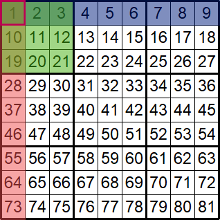
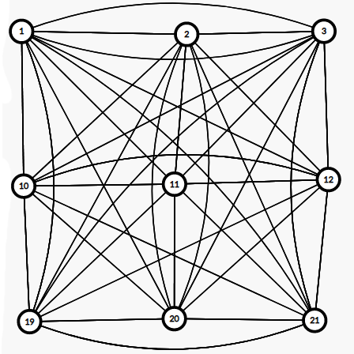
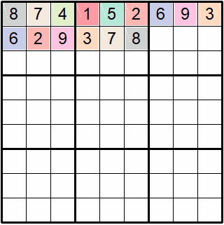

## Sudoku

Implementação de algoritmos para gerar um tabuleiro de sudoku aleatório, verificar se uma solução é válida, gerar uma solução utilizando coloração de grafos e visualização das etapas de forma gráfica ou no terminal como projeto final da disciplina Teoria e Aplicação de Grafos da Universidade de Brasília.

Existem duas versões do projeto, uma contendo visualização gráfica e outra com os dados no terminal.

## Execução:

Para executar o programa, execute o código no diretório atual (windows e linux, respectivamente):

Sem visualização gráfica:
```
py nome_do_arquivo.py
```

```
python3 nome_do_arquivo.py
```

Com visualização gráfica:
```
py nome_do_arquivo.py
```

```
python3 nome_do_arquivo.py
```
_Para visualização gráfica é necessário instalar a biblioteca `turtle` (comando `pip install turtle`)._

## Processo

Basicamente o projeto foi dividido em algumas etapas:

- Verificar se uma solução é válida.
- Interpretar o sudoku como um grafo representado por lista de adjacência.
- Resolver um sudoku utilizando um algoritmo de coloração de grafos.
- Gerar tabuleiros de sudoku aleatórios.

### Verificar se uma solução é válida

A função `check` indica se uma solução do sudoku é válida, verificando se há números distintos em cada linha, coluna e bloco 3x3.

### Interpretar o sudoku como um grafo representado por lista de adjacência

Cada posição da matriz recebe um índice único para identificar o nó, que é conectado com todos os elementos da sua linha, coluna e do seu bloco 3x3, conforme a imagem:



Para facilitar a visualização, isolamos o primeiro bloco 3x3 e suas conexões:



### Resolver um sudoku utilizando um algoritmo de coloração de grafos

Para resolver o sudoku foi utilizado um algoritmo de coloração de grafos com força bruta, representando cada número como uma cor, e, caso não existam cores válidas para o nó atual, a configuração atual é inválida e então outra cor é escolhida para o nó anterior com o _backtracking_ da recursão.

Uma cor é considerada válida se não existe um nó adjacente com a mesma cor.

Visualização do algoritmo executando:



### Gerar tabuleiros de sudoku aleatórios

Pessoalmente considero a parte mais trabalhosa do processo. Apenas colocar números aleatórios nas células, mesmo seguindo as regras de linha, coluna e blocos do sudoku, não garante que exista uma solução para a configuração. Para contornar esse desafio foi utilizada uma técnica chamada _Dig Holes_, baseando [nesse paper](http://zhangroup.aporc.org/images/files/Paper_3485.pdf) (Xiang-Sun ZHANG's Research Group).

A técnica consiste em preencher todas as células de um tabuleiro de sudoku válido de acordo com um _pattern_, que define a ordem dos números processados, gerado aleatoriamente, e logo após ir removendo células aleatoriamente garantindo que existe solução.

imagem removendo células do sudoku

Para gerar um sudoku completo válido utilizamos o algoritmo de coloração citado anteriormente em um tabuleiro vazio.

A função `generate_random_pattern` gera um _pattern_ aleatório embaralhando uma lista com os números de 1 à 9.
